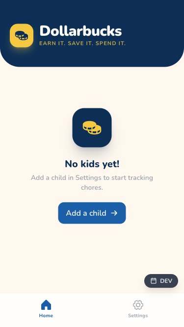

# Dollarbucks



A mobile-first PWA for managing children's allowances and chores. Parents define chores per child; chores either pay a fixed amount immediately or contribute weighted credit toward a weekly allowance.

## Features

- **Chore tracking** — mark chores complete per day or per week
- **Two earning models** — fixed-pay chores post ledger entries instantly; allowance-weighted chores settle on weekly reset
- **Ledger** — full transaction history per child with running balance
- **Weekly reset** — distributes allowance based on chore completion percentage
- **Offline support** — PWA with service worker caching (production builds)
- **Dev date picker** — override the current date to test weekly reset flows

## Stack

| Layer     | Tool                                       |
| --------- | ------------------------------------------ |
| UI        | React 19 + Tailwind CSS                    |
| State     | Zustand (persisted to localStorage)        |
| Routing   | React Router v7                            |
| Icons     | Phosphor Icons                             |
| Build     | Vite + TypeScript                          |
| Unit tests | Vitest + Testing Library                  |
| E2E tests | Playwright (mobile Chromium, 375×667px)    |
| Runtime   | Bun                                        |

## Getting Started

```bash
bun install
bun dev          # http://localhost:5173
```

## Commands

```bash
bun dev              # Start dev server
bun run build        # Type-check + bundle
bun run lint         # ESLint
bun test:unit        # Vitest unit tests
bun test:e2e         # Playwright E2E (auto-starts dev server)
bun test:e2e:ui      # Interactive Playwright runner
```

Run a single test file:

```bash
bun test:unit -- src/features/chores/useChoreActions.test.ts
bun test:e2e -- chores.spec.ts
```

## Project Structure

```text
src/
  features/
    app/        # Global date state
    children/   # Child profiles (name, avatar, weekly allowance)
    chores/     # Chore definitions, completion tracking, toggle logic
    ledger/     # Transaction log and weekly reset
  components/
    ui/         # Shared primitives (Button, Input, Modal, ToggleGroup)
  pages/        # Route targets (Home, ChildDetail, Ledger, Settings)
```

## Earning Models

Chores use one of two `earningType` values:

- **`fixed`** — completing the chore immediately posts a ledger entry for the specified amount; un-completing reverses it
- **`allowance`** — completion is tracked but no money moves until the weekly reset, which distributes the child's `weeklyAllowance` weighted by what percentage of allowance-type chores were completed

TEST DEPLOYMENT
